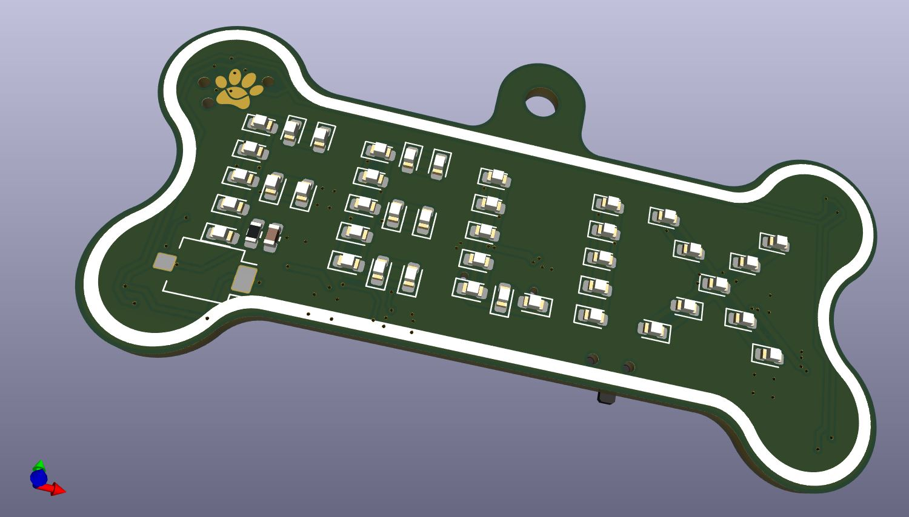
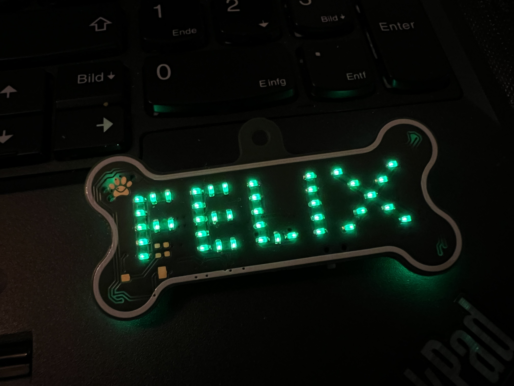

# LED nametag  

 Since many attendees are wearing some blinky LED stuff at the Chaos Communication Congress I wanted to also make myself an eye catcher  and present a little project. It was also a good opportunity to make a proper two layer PCB again to get more practice. The goal was to have the project finished or at least functional for 38C3. Since I got asked by attendees about the tag I decided to make this documentation.
 
The result is a little PCB to be worn e.g. on a collar with the outline shaped like a bone with LEDs arranged so it spells my name.
The electronics basically consists of the following:
- TP4056 lithium charger IC for a 100mAh LiPo battery
- MPM3810 DCDC converter to lower the voltage so all LEDs can be operated in parallel without a resistor
- ATtiny24 microcontroller giving PWM to the MOSFETs that switch the individual letters and the LEDs on the back
- Paw-connect as the ISP interface and as another eye catching feature
- Place for a photodiode to be able to adjust the brightness of the LEDs automatically depending on the surrounding

One tricky thing was to find the right voltage for the DCDC converter output so the LEDs are not too dimm at maximum brightness and not too bright as the duty cycle of the PWM would have to be extremely small on lower brightness settings and therefore one would loose the resolution for the animations.

The firmware only got to a point where I had a single simple animation running without the integration of the mentioned photodiode. That would probably require the code to be made more efficient as the memory of the controller already is quite full.
     
   
 
 
  